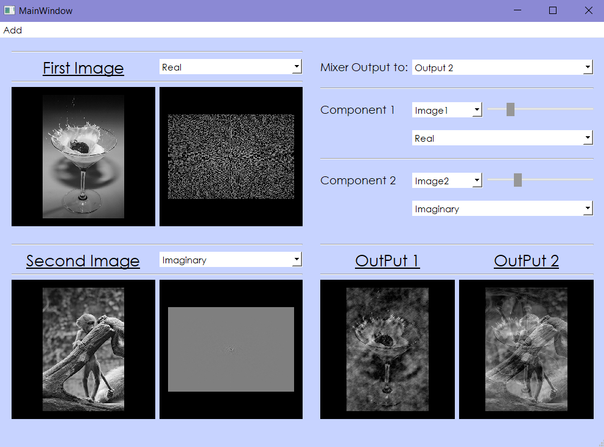

# Image Component Mixer
An Application used to preview components of any image and also mix specific components two Images of the same size like:
* Magnitude-Phase
* Real-Imaginary
* UniMagnitude-Phase
* UniPhase-Magnitude
## Running the Application
Run the file mix.py
## Image

